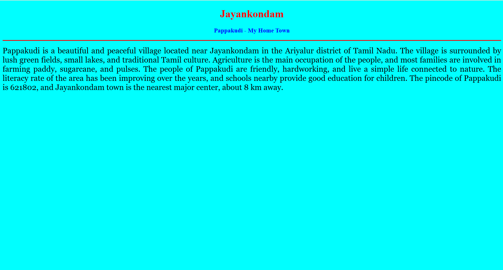
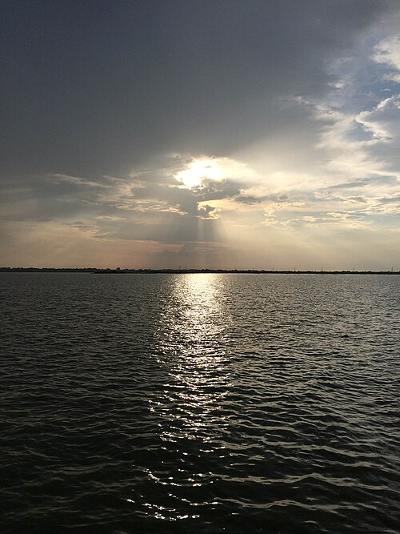

# Ex04 Places Around Me
## Date: 

## AIM
To develop a website to display details about the places around my house.

## DESIGN STEPS

### STEP 1
Create a Django admin interface.

### STEP 2
Download your city map from Google.

### STEP 3
Using ```<map>``` tag name the map.

### STEP 4
Create clickable regions in the image using ```<area>``` tag.

### STEP 5
Write HTML programs for all the regions identified.

### STEP 6
Execute the programs and publish them.

## CODE
## map
```
<html>
<head>
<title>My City</title>
</head>
<body>
<h1 align="center">
<font color="red"><b>pappakudi</b></font>
</h1>
<h3 align="center">
<font color="blue"><b>Latchaya priyan S (212224230139)</b></font>
</h3>
<center>

<map name="MyCity">
<area shape="rect" coords="700,250,850,400" href="home.html" title="My Home Town">
<area shape="circle" coords="550, 610, 300, 280" href="temple.html" title="GANGAIKONDAN TEMPLE">
<area shape="circle" coords="1130, 220, 280, 200" href="lake.html" title="Veeranam lake">
<area shape="circle" coords="705, 190, 260, 200" href="memorial.html" title="Kaduvetti Guru Memorial">
<area shape="circle" coords="1230, 630, 1360, 700" href="suryanar_temple.html" title="suryanr koil">
</map>
</center>
</body>
</html>

```
## home
```
<!DOCTYPE html>
<html>
<head>
    <title>My Home Town</title>
</head>

<body bgcolor="cyan">
    <h1 align="center">
        <font color="red"><b>Jayankondam</b></font>
    </h1>

    <h3 align="center">
        <font color="blue"><b>Pappakudi - My Home Town</b></font>
    </h3>

    <hr size="3" color="red">

    <p align="justify">
        <font face="Georgia" size="5">
            Pappakudi is a beautiful and peaceful village located near Jayankondam in the Ariyalur district of Tamil Nadu.
            The village is surrounded by lush green fields, small lakes, and traditional Tamil culture. 
            Agriculture is the main occupation of the people, and most families are involved in farming paddy, sugarcane, and pulses. 
            The people of Pappakudi are friendly, hardworking, and live a simple life connected to nature.
            The literacy rate of the area has been improving over the years, and schools nearby provide good education for children. 
            The pincode of Pappakudi is 621802, and Jayankondam town is the nearest major center, about 8 km away.
        </font>
    </p>
</body>
</html>

```
## lake
```
<html>
<head>
<title>Veeranam Lake - man made history</title>

<style>
  body {
    background-color: #FFF8E7;
    font-family: "Georgia", serif;
    text-align: center;
    margin: 0;
    padding: 0;
  }

  h1 {
    color: navy;
    font-size: 48px;
    margin-top: 40px;
  }

  h3 {
    color: teal;
    font-size: 26px;
    margin-bottom: 30px;
  }

  img {
    border-radius: 12px;
    width: 70%;
    max-width: 800px;
    height: auto;
    box-shadow: 0 4px 12px rgba(0, 0, 0, 0.3);
  }

  p {
    width: 70%;
    margin: 30px auto;
    font-size: 20px;
    line-height: 1.8;
    color: #333;
    text-align: justify;
  }

  a {
    text-decoration: none;
    background-color: navy;
    color: white;
    padding: 12px 25px;
    border-radius: 8px;
    font-size: 20px;
    transition: 0.3s;
  }

  a:hover {
    background-color: #4169E1;
    transform: scale(1.05);
  }
</style>

</head>
<body>

<h1><b>Veeranam Lake</b></h1>
<h3><b>The Ancient Reservoir of Tamil Nadu</b></h3>

<center>
  
</center>

<p>
<b>Veeranam Lake</b> is a historic freshwater lake located in the Cuddalore district of Tamil Nadu, India. 
The lake was constructed during the reign of the Chola dynasty in the 10th century AD by Rajaditya Chola, 
the son of Parantaka Chola I, to provide a reliable water source for irrigation and drinking purposes. 
Stretching over 14 kilometers in length and up to 4 kilometers wide, Veeranam Lake was originally built to harness 
the water of the Kollidam River and support extensive agricultural activities in the region. The lake is still a vital resource today, 
supplying water to towns and cities, including Chennai. Veeranam Lake stands as a testament to the advanced engineering skills of the Cholas, 
their vision for sustainable water management, and their immense contribution to Tamil civilization.
</p>

<h3>
  <a href="map.html">Back to home Map</a>
</h3>

</body>
</html>

```
## temple
```
<html>
<head>
<title>Gangaikonda Cholapuram Temple-jayankodacholapuram</title>

<style>
  body {
    background-color: #FFF8E7;
    font-family: "Georgia", serif;
    text-align: center;
    margin: 0;
    padding: 0;
  }

  h1 {
    color: brown;
    font-size: 48px;
    margin-top: 40px;
  }

  h3 {
    color: green;
    font-size: 26px;
    margin-bottom: 30px;
  }

  img {
    border-radius: 12px;
    width: 70%;
    max-width: 800px;
    height: auto;
    box-shadow: 0 4px 12px rgba(0, 0, 0, 0.3);
  }

  p {
    width: 70%;
    margin: 30px auto;
    font-size: 20px;
    line-height: 1.8;
    color: #333;
    text-align: justify;
  }

  a {
    text-decoration: none;
    background-color: brown;
    color: white;
    padding: 12px 25px;
    border-radius: 8px;
    font-size: 20px;
    transition: 0.3s;
  }

  a:hover {
    background-color: #A52A2A;
    transform: scale(1.05);
  }
</style>

</head>
<body>

<h1><b>Gangaikonda Cholapuram Temple</b></h1>
<h3><b>History In Stone Of Tamil Nadu</b></h3>

<center>
  
</center>

<p>
<b>Gangaikonda Cholapuram temple</b>The historic city of Gangaikonda Cholapuram in Tamil Nadu, India, was established as the new capital of the Chola Empire around 1025 CE by Emperor Rajendra Chola I 
to commemorate his victorious military expedition to the Gangetic plains of North India. He assumed the title "Gangaikonda Chola" (the Chola who conquered the Ganges) 
and built the magnificent Brihadisvara Temple (also known as the Gangaikondacholisvaram temple) as a "liquid pillar of victory". This grand Shiva temple, a UNESCO World Heritage Site 
and a masterpiece of Dravidian architecture, served as the Chola capital for approximately 250 years, showcasing the dynasty's immense power, artistic achievements, and control over South India and parts of Southeast Asia.
</p>

<h3>
  <a href="map.html">Back to home map</a>
</h3>

</body>
</html>
```

## suryanar temple 
```
<html>
<head>
<title>Suryanar Kovil</title>

<style>
  body {
    background-color: #FFF8E7;
    font-family: "Georgia", serif;
    text-align: center;
    margin: 0;
    padding: 0;
  }

  h1 {
    color: darkorange;
    font-size: 48px;
    margin-top: 40px;
  }

  h3 {
    color: darkred;
    font-size: 26px;
    margin-bottom: 30px;
  }

  img {
    border-radius: 12px;
    width: 70%;
    max-width: 800px;
    height: auto;
    box-shadow: 0 4px 12px rgba(0, 0, 0, 0.3);
  }

  p {
    width: 70%;
    margin: 30px auto;
    font-size: 20px;
    line-height: 1.8;
    color: #333;
    text-align: justify;
  }

  a {
    text-decoration: none;
    background-color: darkorange;
    color: white;
    padding: 12px 25px;
    border-radius: 8px;
    font-size: 20px;
    transition: 0.3s;
  }

  a:hover {
    background-color: #e67300;
    transform: scale(1.05);
  }
</style>

</head>
<body>

<h1><b>Suryanar Kovil</b></h1>
<h3><b>Temple of the Sun God – A Navagraha Shrine</b></h3>

<center>
  
</center>

<p>
<b>Suryanar Kovil</b> is a renowned Hindu temple dedicated to <b>Lord Surya (the Sun God)</b>, located near Kumbakonam in Tamil Nadu. It is one of the <b>Navagraha temples</b>, representing the planet Sun. The temple was built by the Chola kings in the 11th century and is known for its magnificent architecture and spiritual significance. Devotees visit this temple to seek blessings for health, prosperity, and success. The shrine houses the Sun God along with his consorts Usha and Chhaya, and within its complex are separate shrines for all nine planetary deities. Suryanar Kovil stands as a shining example of Tamil heritage, devotion, and astronomical wisdom.
</p>

<h3>
  <a href="map.html">Back to home Map</a>
</h3>

</body>
</html>

```
## memorial
```
<html>
<head>
<title>Kaduvetti Guru Memorial</title>

<style>
  body {
    background-color: #FFF8E7;
    font-family: "Georgia", serif;
    text-align: center;
    margin: 0;
    padding: 0;
  }

  h1 {
    color: maroon;
    font-size: 48px;
    margin-top: 40px;
  }

  h3 {
    color: darkgreen;
    font-size: 26px;
    margin-bottom: 30px;
  }

  img {
    border-radius: 12px;
    width: 70%;
    max-width: 800px;
    height: auto;
    box-shadow: 0 4px 12px rgba(0, 0, 0, 0.3);
  }

  p {
    width: 70%;
    margin: 30px auto;
    font-size: 20px;
    line-height: 1.8;
    color: #333;
    text-align: justify;
  }

  a {
    text-decoration: none;
    background-color: maroon;
    color: white;
    padding: 12px 25px;
    border-radius: 8px;
    font-size: 20px;
    transition: 0.3s;
  }

  a:hover {
    background-color: #800000;
    transform: scale(1.05);
  }
</style>

</head>
<body>

<h1><b>Kaduvetti Guru Memorial</b></h1>
<h3><b>Honoring a Crusader for Vanniyar Rights</b></h3>

<center>
  
</center>

<p>
<b>Kaduvetti Guru</b>, also known as J. Gurunathan, was a prominent political leader and social activist in Tamil Nadu. 
He played a pivotal role as the chief of the Vanniyar Sangam, advocating tirelessly for the rights and upliftment of the 
Vanniyar community. Kaduvetti Guru was known for his passionate speeches, grassroots mobilization, and unwavering commitment 
to social justice. His efforts contributed significantly to the reservation movement for Vanniyars and other marginalized groups. 
Despite controversies, he is remembered as a fearless leader who dedicated his life to his people. The memorial stands as a tribute 
to his enduring legacy and impact on Tamil Nadu’s political and social landscape.
</p>

<h3>
  <a href="map.html">Back to home Map</a>
</h3>

</body>
</html>

```
## OUTPUT


 [alt text](README.md)



## RESULT
The program for implementing image maps using HTML is executed successfully.
